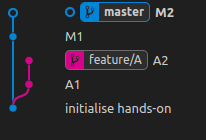
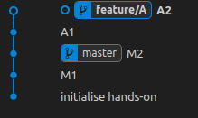

# Rebasing

## Theory

**What is git rebase**
Rebasing is the process of moving or combining a sequence of commits to a new base commit.
From a content perspective, rebasing is changing the base of your branch from one commit to another making it appear as if you'd created your branch from a different commit `1`

<br>
<div style="display: flex; justify-content: center;">

</div>
<br>

**when to use it**
TODO

## Hands-on

### Scenario 1

Imagine a scenario in which the primary branch has progressed since you started working on a feature branch. You want to get the latest updates to the main branch in your feature branch. `1`

#### 1. Preparing hands-on

``` sh
mkdir rebase-hands-on
cd rebase-hands-on
```

``` sh
git init 
echo "git rebase hands-on" > README.md
git add .
git commit -m "initialise hands-on"
```

``` sh
$ git log --oneline
6655fb9 (HEAD -> master) initialise hands-on
```

#### 2. Populating features and commits

You are working on a feature called `A`. you create a feature branch and you commit the features

``` sh
## create a new feature branch
git checkout -b feature/A
## commit A1
echo "commit A1" >> feature_a.md
git add .
git commit -m "A1"
## commit A2
echo "commit A2" >> feature_a.md
git add .
git commit -m "A2"
```

``` sh
$ git log --oneline
61c6984 (HEAD -> feature/A) A2
9ff7b7d A1
6655fb9 (master) initialise hands-on
```

A developer in your team has add new commits to the master branch

``` sh
### master branch
# commit M1
echo "commit M1" > master.md
git add .
git commit -m "M1"
# commit M1
echo "commit M2" >> master.md
git status
git add .
git commit -m "M2"
```

``` sh
$ git log --oneline
f93cf92 (HEAD -> master) M2
8d70434 M1
6655fb9 initialise hands-on
```

<div style="display: flex; justify-content: center;">

</div>

#### 3. Rebasing

You need to integrate the changes that have been added to the master branch to the `feature/A` branch.

Rebase `feature/A` onto the branch `master`

``` sh
# in branch feature/A
git rebase master
```

<div style="display: flex; justify-content: center;">

</div>

## Notes

* Remember that `git rebase`  is used to combine commits and modify history of a branch, so use it only on the branches that you are working on

## Resources

* `1` [bitbucket - git rebase](https://www.atlassian.com/git/tutorials/rewriting-history/git-rebase)
* `2` [How to Use Git Rebase – Tutorial for Beginners](https://www.freecodecamp.org/news/how-to-use-git-rebase/)